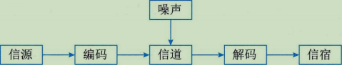

# SIPM

系统集成项目管理笔记

## 第一章 信息化发展

### 1.1 信息与信息化

* *信息*
  **指音讯、消息、信息系统传输、信息系统处理的对象，泛指人类社会传播的一切内容，由意义和符号组成，指以声音、语言、文字、图像、动画、气味、等方式所表示的实际内容**
  > 信息是**抽象物质的映射集合**
  >
* *信息化*
  **指在国家宏观信息政策指导下，通过对信息技术开发、信息产业的发展、信息人才的配置，最大限度地利用信息资源满足全社会的信息需求，从而加速社会各个领域的共同发展以推进信息社会的过程**
* *信息的目的*
  **消除不确定的因素**
* *信息的特征*
  **客观性，普遍性、无限性、动态性、相对性、依附性、变化性、传递性、层次性、系统性、转化性**

1. 客观性：决策、指令、计划最后都会转化为实际行动 （客观信息例如：国际形势、经济发展、一年四季）
2. 普遍性：物质的普遍性决定了信息的普遍存在
3. 无限性：
4. 动态性：信息是随着时间而变化的
5. 相对性：不同的认识主体从同一事物中获取的信息及信息量可能是不同的
6. 依附性：信息是客观世界的反映，信息必然是客观事物所产生的，不存在无源信息;任何信息都要依附于一定的载体而存在，需要有物质的承载者，信息不能完全脱离物质而独立存在
7. 变化(换)性：信息通过处理可以实现变化和转换，使其形式和内容发生变化以适应特定的需要
8. 传递性：信息在**时间上的传递**就是**存储**、在**空间**上的的传递就是**转移或扩散**
9. 层次性：
10. 系统性：可以与现实世界形成对应的信息系统
11. 转化性：信息的产生不能没有载体，信息的传递不能没有能量，但有效的使用信息可以转化为物质或者能量

* *信息的质量*
  **精确性、完整性、可靠性、及时性、经济性、可验证性、安全性**

1. 精确性：对事物状态描述的精准程度
2. 完整性：对事物状态描述的全面程度，完整信息应包括所有重要事实
3. 可靠性：指信息的来源、采集方法、传输过程是可以信任的，符合预期
4. 及时性：指的是获取信息的时刻与事件发生时刻的间隔长短
5. 经济性： 信息获取、传输带来的成本都在可接受范围之内
6. 可验证性：主要质量属性可被证实或者证伪的程度
7. 安全性：在信息的生命周期中，信息可以被授权访问的可能性，可能性越低，安全系数越高

* *信息的传输模型*

    

1. 信源：是产生信息的实体，由这个实体向外传播
2. 信宿：是信息的归宿或接收者
3. 信道：传送信息的通道，TCP/IP、光纤、同轴电缆、双绞线、移动通信网络、卫星、微波
4. 编码器：变换信号的设备，实际上是终端机的发送部分，包括从信源到信道的所有设备，量化器、压缩编码器、调制器，使信源变成适于信道传输的信号，从安全角度出发，编码器还可以包括加密解密设备
5. 译码器：把信道上的信号转换成信宿能够接受的信号，解调器、译码器、数模转换器
6. 噪声：

> 信息系统的主要性能指标是有效性和可靠性
>
> 信息系统的基本规律应包括信息的度量、信源的特性、信源编码、信道特性、信道编码、检测理论、估计理论、密码学
